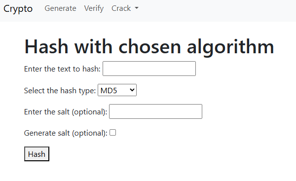
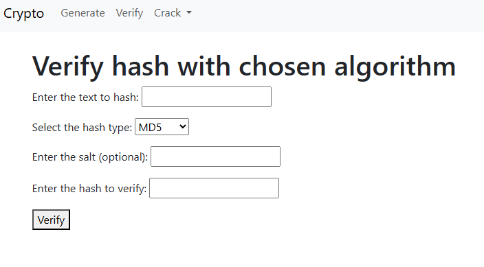
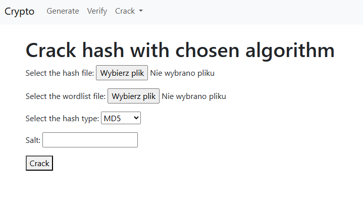
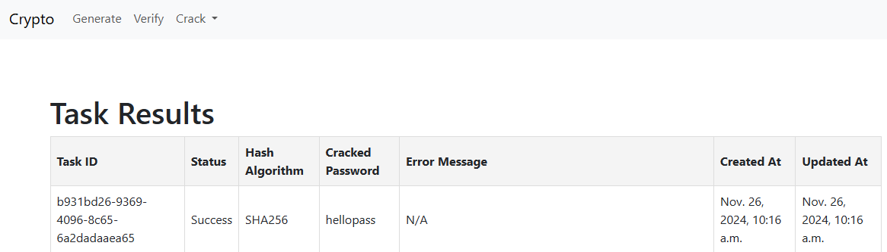

# App designed to centralize hash functions.
## The main goal is to provide a simple and easy way to generate, verify and crack hashes through a user-friendly interface.

### Table of contents:
- [Features](#features)
- [Technologies](#technologies)
- [Installation](#installation)
- [Generate hashes](#generate-hashes)
- [Verify hashes](#verify-hashes)
- [Crack hashes](#crack-hashes)

### Features:
- Generate hashes from a given string with the following algorithms:
  - MD5
  - SHA1
  - SHA256
  - SHA512
- Verify if a given hash matches a given string with above algorithms.
- Crack hashes using dictionary attack.

### Technologies:
- Frontend:
  - HTML
  - CSS
  - JavaScript
  - Bootstrap
- Backend:
  - Django
  - PostgreSQL
  - Celery - for task scheduling
  - Redis - as a message broker
- Deployment:
  - Docker
  - Docker Compose
### Installation:
1. Clone the repository:
```bash
git clone https://github.com/b4rtosh/hash-app-repo.git
```
Or download the zip file directly from the repository.
2. Make sure you have Docker installed on your machine.
3. Navigate to 'default.env' file and change its name to '.env', the value of 'SECRET' and 'DB_PASSWORD' to your own secret and password.
4. Run the following command to build the Docker image:
```bash
docker-compose build
```
5. Run the following command to start the application:
```bash
docker-compose up
```
6. Access the application through your browser at the following address:
```bash
http://localhost:80
```

### Generate hashes:
After accessing the application, you will be able to generate hashes 
by clicking on the "Generate" tab in the navbar. 
Then, you can select the algorithm you want to use, the string you want to hash and optionally
add specific or generate salt.
The form will look like this:<br>
<br>
The result will be displayed automatically after clicking the "Hash" button in the result endpoint.

### Verify hashes:
To verify a hash, you need to click on the "Verify" tab in the navbar.
Then, you can select the algorithm you want to use, the string you want to verify and the hash you want to compare. 
Also, you can add a specific salt.
The form will look like this:<br>
<br>
The result will be displayed automatically after clicking the "Verify" button in the result endpoint.

### Crack hashes:
To crack a hash, you need to click on the "Crack" and then "Schedule" tab in the navbar.
Then, you can select the algorithm you want to use, the file with hash you want to crack and the dictionary file you want to use.
The form will look like this:<br>
<br>
As the result you will get the information about success or failure of the task scheduling. You can
get to results template by clicking the "Go to Results" button or "Crack" and "Results" tab in the navbar.
The results are displayed in a table with the following columns:<br>
<br>
